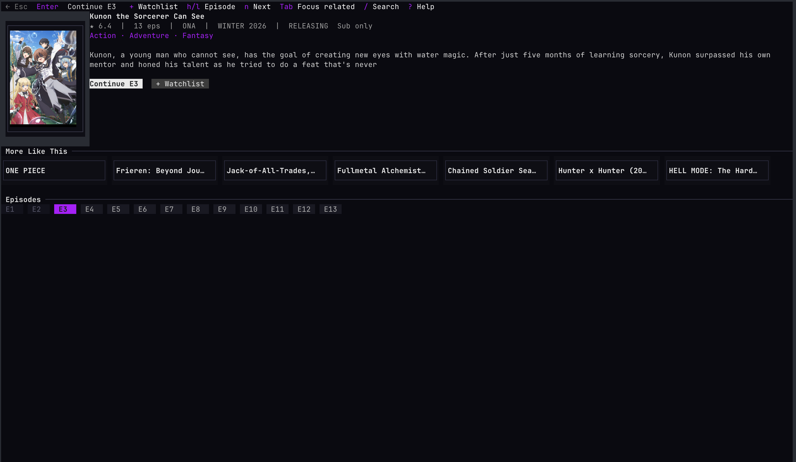
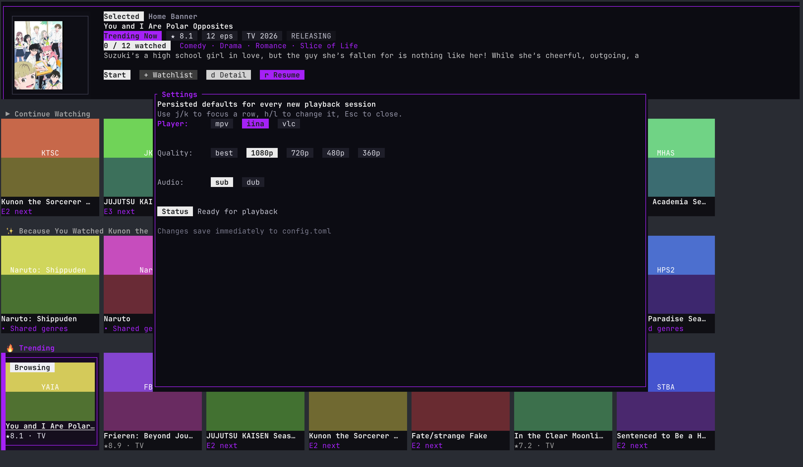
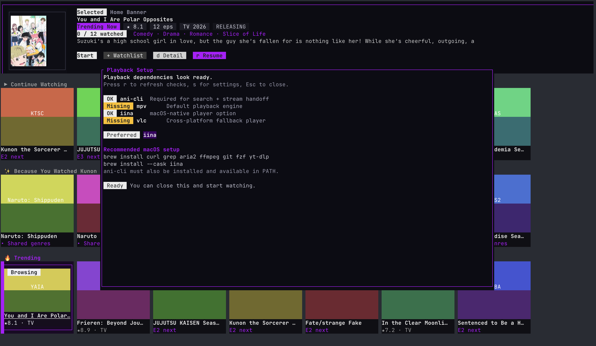
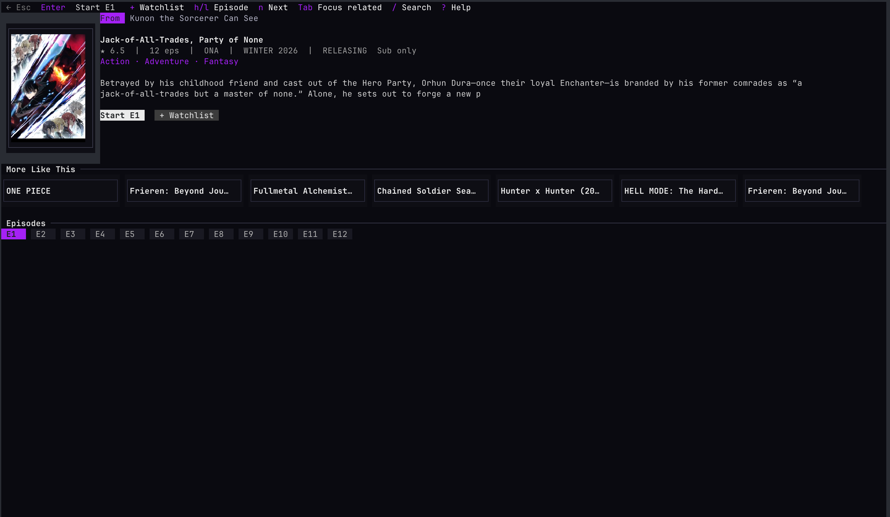

# ani-tui

A production-ready terminal UI for anime, powered by [ani-cli](https://github.com/pystardust/ani-cli).

`ani-tui` is a keyboard-first desktop terminal experience for browsing anime, resuming watch progress, and handing playback off to an externally installed player through `ani-cli`.

It is built for local-first use: metadata is cached in SQLite, recommendations are generated from your own watch behavior, and the app stays usable even when network access is limited.

```
╔══════════════════════════════════════════════════════════════════════════╗
║  ani-tui                                                                 ║
║  ▶ Continue Watching  ──────────────────────────────────────────────     ║
║  ┌────────────────────┐  ┌────────────────────┐  ┌────────────────────┐  ║
║  │  ████████████████  │  │  ████████████████  │  │  ████████████████  │  ║
║  │  ████████████████  │  │  ████████████████  │  │  ████████████████  │  ║
║  │  ████████████████  │  │  ████████████████  │  │  ████████████████  │  ║
║  │  Attack on Titan   │  │  Demon Slayer      │  │  Jujutsu Kaisen    │  ║
║  │  ★9.0 · TV         │  │  ★8.9 · TV         │  │  ★8.7 · TV         │  ║
║  └────────────────────┘  └────────────────────┘  └────────────────────┘  ║
║  🔥 Trending  ───────────────────────────────────────────────────────     ║
╚══════════════════════════════════════════════════════════════════════════╝
```

## What It Does

- Browse a curated anime home screen with continue watching, watchlist, seasonal, trending, and recommendation rows
- Resume directly into the next episode with persisted watch history
- Surface local heuristic recommendations with explainable reasons such as shared genres and popularity signals
- Hand playback off to `ani-cli` while keeping the TUI responsive

## Stack

- Rust
- `ratatui` + `crossterm`
- `sqlx` with SQLite
- `reqwest`
- `ani-cli` as an external playback runtime dependency

## Features

- **Curated home screen** — featured banner + category rows (Continue Watching, Watchlist, Recommended, Trending, Popular, Top Rated, Seasonal)
- **Detail screen** — cover art, metadata, scrollable episode pills with watched indicators
- **Real cover images** — Kitty Graphics Protocol on supported terminals (Ghostty); halfblock fallback everywhere else
- **Heuristic recommendation engine** — local-first `Because You Watched` and `More Like This` rows built from watch history, genres, format, recency, and cached popularity signals
- **Playback via ani-cli** — detached external-player handoff with next-episode (`n`) directly from the detail screen
- **Watch history** — episodes marked watched on play, persist across sessions
- **Watchlist** — add/remove with `+`, updates the home row immediately
- **Search** — instant SQLite local search + AniList network fallback for full catalogue
- **Offline-capable** — SQLite cache with TTL-based staleness; home screen loads from cache with no network needed
- **Production overlays** — help, search, settings, and setup/dependency checks are available in-app

## Screenshots

Current interface captures from the production v1 UI.

### Home Screen


### Detail Screen



### Settings Overlay



### Playback Setup Overlay



### Related Recommendation Drill-In



## Prerequisites

Before running `ani-tui`, make sure these runtime dependencies are installed:

- [ani-cli](https://github.com/pystardust/ani-cli) must be installed and available on `$PATH`
- A supported video player must be installed
  - `mpv` is the default player
  - on macOS, `ani-tui` can use `iina` directly and will also fall back to it when `mpv` is missing
  - `vlc` is also supported
- A terminal with truecolor support is recommended
  - banner and detail images work on supported terminals
  - `Home` row cards intentionally use the stable halfblock cover renderer

### Verify Prerequisites

Run these commands before launching the app:

```bash
which ani-cli
which mpv
```

If you plan to use VLC instead of mpv:

```bash
which vlc
```

If any command prints `not found`, install that dependency first and make sure it is on your shell `$PATH`.

## Requirements

- Rust toolchain (`cargo`) for building from source
- The runtime prerequisites above

## Installation

### Install With Cargo (crates.io)

```bash
cargo install ani-tui-app
```

Then install the runtime dependencies listed below.

### Install on macOS

Primary path:

```bash
brew tap logando-al/tap
brew install ani-tui
```

Homebrew formula source:
- [logando-al/homebrew-tap](https://github.com/logando-al/homebrew-tap)

Then install playback dependencies:

```bash
brew install curl grep aria2 ffmpeg git fzf yt-dlp
brew install --cask iina
```

Install `ani-cli` separately and ensure it is on your `PATH`.

### Install on Linux

Option 1: download a release binary and place it on your path.

```bash
mkdir -p ~/.local/bin
cp ./ani-tui ~/.local/bin/ani-tui
chmod +x ~/.local/bin/ani-tui
```

Option 2: install from crates.io with Cargo.

```bash
cargo install ani-tui-app
```

Install runtime dependencies with your distro package manager, then install `ani-cli` separately.

Debian / Ubuntu example:

```bash
sudo apt install mpv vlc curl grep aria2 ffmpeg fzf yt-dlp
```

Fedora example:

```bash
sudo dnf install mpv vlc curl grep aria2 ffmpeg fzf yt-dlp
```

Arch example:

```bash
sudo pacman -S mpv vlc curl grep aria2 ffmpeg fzf yt-dlp
```

### Build From Source

```bash
git clone https://github.com/logando-al/ani-tui.git
cd ani-tui
cargo build --release
# Copy binary to PATH
cp target/release/ani-tui ~/.local/bin/
```

## Running Tests

Run the standard validation commands before opening a pull request or cutting a release:

```bash
cargo check
cargo test
```

## Usage

```bash
ani-tui
```

If playback does not start, the most common cause is a missing `ani-cli` or missing player binary.

On first run, `ani-tui` will open the in-app setup screen automatically if playback dependencies are missing.

### Keybindings

#### Home
| Key | Action |
|-----|--------|
| `j` / `k` | Move between category rows |
| `h` / `l` | Scroll cards left / right |
| `Enter` | Open detail screen |
| `/` | Search |
| `s` | Open settings |
| `!` | Open setup / dependency checks |
| `?` | Help overlay |
| `r` | Resume highlighted anime |
| `Shift+R` | Refresh home data |
| `q` / `Esc` | Quit |

#### Detail
| Key | Action |
|-----|--------|
| `h` / `l` | Navigate episodes |
| `Tab` | Toggle focus between Episodes / More Like This |
| `Enter` | Start / continue selected episode, or open focused related anime |
| `+` | Toggle watchlist |
| `n` | Play next episode |
| `/` | Search |
| `s` | Open settings |
| `!` | Open setup / dependency checks |
| `?` | Help overlay |
| `Esc` / `q` | Back |

#### Search
| Key | Action |
|-----|--------|
| Type | Update search query |
| `↑` / `↓` | Move cursor |
| `Enter` | Open detail |
| `Esc` | Close |

#### Settings
| Key | Action |
|-----|--------|
| `j` / `k` | Move between preference rows |
| `h` / `l` | Change selected preference |
| `Enter` | Advance the selected preference |
| `Esc` | Close |

#### Setup
| Key | Action |
|-----|--------|
| `r` | Refresh dependency checks |
| `s` | Open settings |
| `Esc` | Close |

## Configuration

Config file is created automatically at first run:

- **Linux**: `~/.config/ani-tui/config.toml`
- **macOS**: `~/Library/Application Support/ani-tui/config.toml`

```toml
quality    = "best"      # best | 1080p | 720p | 480p | 360p
audio_mode = "sub"       # sub | dub
player     = "mpv"       # preferred player: mpv | iina | vlc

[cache]
trending_ttl = 86400     # seconds (24h)
stable_ttl   = 604800    # seconds (7 days)
```

## Architecture

```
src/
  api/
    anilist.rs    — AniList GraphQL client (trending, popular, top rated, seasonal, search)
    player.rs     — ani-cli subprocess wrapper
  db/
    mod.rs        — SQLite init + migrations
    cache.rs      — Anime metadata model + read/write
    user.rs       — Watch history, continue watching, watchlist
    sync.rs       — TTL-based cache staleness
  services/
    sync.rs       — Orchestrates AniList → SQLite sync + heuristic recommendations
  ui/
    home.rs       — Curated home screen
    detail.rs     — Anime detail + episode list
    playback.rs   — Log stream + controls
    search.rs     — Search overlay
    help.rs       — Help overlay + toast notifications
    settings.rs   — Settings overlay
    setup.rs      — Dependency / onboarding overlay
    components/
      cover.rs    — Halfblock cover renderer + Kitty image support
  state/mod.rs    — AppState, Screen enum, navigation helpers
  config.rs       — Config loading/saving
  error.rs        — AppError + Result type
  main.rs         — Event loop, input handlers, background task coordination
migrations/
  001_initial.sql — Database schema
```

## Data Sources

- **Metadata**: [AniList GraphQL API](https://anilist.co/graphql) — no API key required
- **Playback**: [ani-cli](https://github.com/pystardust/ani-cli) — streams from supported providers

## Distribution Notes

- `ani-tui` ships as an MIT-licensed Rust application
- `ani-cli` remains an external runtime dependency and is not bundled with this project
- The crates.io package name is `ani-tui-app`, while the installed executable remains `ani-tui`

## Contributing

Contributions are welcome.

If you want to contribute:

- Open an issue for bugs, regressions, or feature proposals
- Fork the repository and create a focused branch for your change
- Keep pull requests small and clearly scoped
- Include screenshots or terminal recordings for UI changes when possible
- Run the project checks before opening a pull request:

```bash
cargo check
cargo test
```

For larger changes, open an issue first so the direction can be agreed before implementation.

## Acknowledgements

- [`ani-cli`](https://github.com/pystardust/ani-cli) powers the playback handoff used by `ani-tui`
- [`AniList`](https://anilist.co/) provides the metadata used for browsing, search, and cached catalog views

`ani-tui` builds its own local UI, persistence, and heuristic recommendation flow, but playback depends on the external `ani-cli` tool. Credit to the `ani-cli` project for the playback engine this app integrates with.

## Production Release

- GitHub Releases are the source of truth for production binaries
- macOS users should prefer the Homebrew tap
- Linux users should prefer the release binary or `cargo install`
- Use the release checklist in the repository before tagging a new version: `RELEASE-CHECKLIST.md`

## License

MIT. See `LICENSE`.
